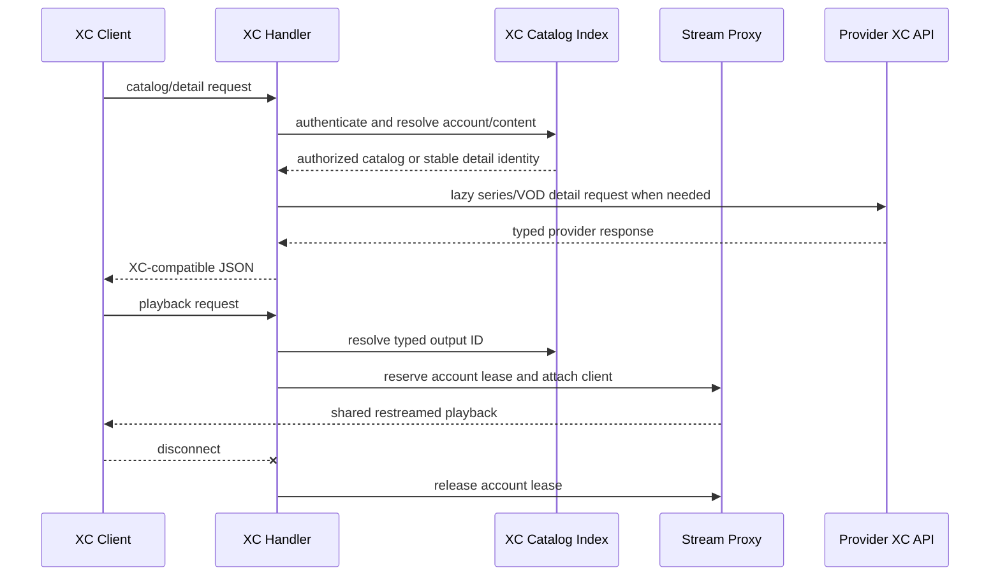

# Xtream API Compatibility - Plan

## Goal Capsule

- **Objective:** Make the prioritized Xtream Codes input and output behavior reliable for common IPTV clients without changing KPTV Proxy's core aggregation model.
- **Authority:** The scoped user decision covers account playback limits, series episodes, VOD details, category filtering, safe URL construction, stable content identity, and compatibility tests. Catch-up and timeshift remain deferred.
- **Execution profile:** Standard, cross-cutting external API compatibility work.
- **Stop conditions:** Do not add catch-up/timeshift, redesign the admin UI, or replace the shared restreaming architecture as part of this plan.
- **Tail ownership:** The implementer owns integration cleanup, documentation updates, and removal of abandoned experimental paths before declaring the Definition of Done complete.

---

## Product Contract

### Summary

KPTV Proxy aggregates M3U and Xtream Codes provider catalogs into a unified service and re-exposes the result through Xtream-compatible endpoints. Its current output layer supports basic catalogs and playback, but it lacks the stable identity and lifecycle semantics needed for VOD details, series episodes, category filtering, and per-account playback limits.

### Problem Frame

The current implementation represents aggregated content primarily as channels keyed by display name. Output stream IDs are hashes of those names, while provider VOD and series details require provider-specific IDs and episode records. Metadata API requests also consume account connection counters, while playback bypasses those counters. These choices produce incorrect authorization, incomplete series behavior, and compatibility failures for clients that follow common Xtream request sequences.

### Requirements

#### Catalog and detail compatibility

- R1. Live, VOD, and series catalog actions must honor optional `category_id` filters while preserving account content permissions and current deterministic ordering.
- R2. `get_vod_info` must return a compatible object response for a listed VOD item, including stable identity, playback metadata, and tolerant handling of incomplete provider metadata.
- R3. `get_series_info` must return compatible series information, seasons, and episode arrays keyed by season, with provider episode IDs and container extensions preserved for playback.
- R4. Detail and playback requests must resolve through a stable content identity model rather than relying solely on display-name hashes or an unrestricted channel scan.

#### Authorization and lifecycle

- R5. Configured XC output account connection limits must apply to active playback sessions, not catalog or detail requests.
- R6. Live, VOD, and series enable flags must be enforced consistently for listing, detail, and playback requests.
- R7. Account admission must be atomic under concurrent requests and must release on disconnect, failed setup, timeout, and other terminal playback paths.

#### Request and URL handling

- R8. Xtream credentials and action parameters must be encoded by URI component, exactly once, for upstream provider requests and generated output URLs.
- R9. `player_api.php` must normalize supported GET query and form-encoded POST parameters with a defined conflict rule.
- R10. Provider errors, malformed payloads, valid-empty catalogs, and partial detail responses must be distinguished so incomplete data is not published or cached as valid content.

#### Verification

- R11. HTTP-level compatibility tests must cover authentication, catalog actions, category filtering, VOD details, series details and playback, content authorization, request encoding, and concurrent account admission.
- R12. Playlist and detail caches must be isolated by stable account identity and authorization generation so credential or permission changes cannot disclose another account's content.

### Scope Boundaries

#### In scope

- Xtream input catalog metadata and provider-ID retention needed for VOD and series compatibility.
- Xtream output actions, response shapes, category filtering, detail lookups, and content-aware playback resolution.
- Account playback leases and cleanup behavior.
- Query/path encoding and GET/form POST request normalization.
- Focused documentation updates for supported actions and compatibility limits.

#### Deferred to Follow-Up Work

- Catch-up, timeshift, TV archive, and replay endpoints.
- Full VOD/series metadata parity beyond fields required by common client flows.
- Provider-specific pagination, vendor extensions, and universal compatibility with malformed/non-standard panels.
- Replacing the existing aggregation/channel model across non-Xtream playlist consumers.

### Assumptions

- `MaxConnections` means concurrent playback sessions only.
- Existing playback sessions continue after an account update or deletion; new requests use current account configuration. Immediate revocation is deferred.
- Generated output IDs remain opaque and compatibility-preserving where possible. New ID resolution must detect collisions rather than silently selecting the first channel.
- Absent or `0` category filters mean all authorized content; unknown categories return an empty array.
- Invalid credentials return the existing unauthorized behavior. Valid credentials requesting disabled, stale, or unknown content return a non-leaking not-found response unless an existing client contract requires otherwise.
- The XC contract is ecosystem-defined rather than governed by a current official specification. Maintained community implementations and existing project behavior are compatibility references, not normative authorities.
- The minimum compatibility matrix is the documented action sequence for base account info, live/VOD/series categories and catalogs, `get_vod_info`, `get_series_info`, EPG lookups, M3U output, and typed playback, using the cited community implementations and recorded fixtures rather than promising support for every named client.
- Persisted XC account database IDs become the stable runtime identity used to match refreshed configuration entries and preserve active lease state across account slice replacement.
- EPG is a regression surface in this plan, not a new EPG feature: existing EPG actions must use the typed lookup and authorization boundary without adding archive or schedule behavior.

---

## Planning Contract

### Key Technical Decisions

- KTD1. Make `StreamProxy` the owner of an explicit XC catalog identity/index snapshot. The current `types.Channel` model remains the restreaming source, but XC lookup records retain content type, provider/source identity, output ID, and detail/playback metadata needed to resolve requests deterministically. The index is built from a completed `ImportStreams` generation and published atomically with the replacement channel snapshot.
- KTD2. Preserve provider IDs for imported VOD and series records and fetch VOD and series details lazily. Lazy detail lookup avoids making every periodic catalog refresh download potentially large metadata, while bounded per-source concurrency, request deadlines, cache-stampede protection, and a bounded cache prevent detail requests from amplifying provider load.
- KTD3. Use generated category IDs consistently on output and filter against those IDs. Provider category IDs remain input metadata; live, VOD, and series category namespaces stay independent.
- KTD4. Move account connection admission to playback lifecycle boundaries. Use a stable runtime account registry keyed by persisted account identity rather than incrementing slice-element pointers during short metadata requests, because admin updates replace `Config.XCOutputAccounts`.
- KTD5. Centralize URI construction. Use structured query encoding for provider requests and component-level path encoding for generated URLs, with tests documenting the router's behavior for encoded reserved characters.
- KTD6. Treat endpoint responses as typed compatibility contracts. Endpoint-specific decoders validate arrays, objects, IDs, and error payloads; valid-empty results are distinct from failed or incomplete results. Empty endpoint results may be cached only when the complete response is valid and the cache contract explicitly distinguishes valid-empty from unavailable.

### High-Level Technical Design

The catalog index must be published atomically with refreshed imported content so catalog listings, detail lookups, and playback IDs cannot observe different refresh generations. Detail caches must be keyed by provider/source identity and invalidated with the associated catalog generation or source credentials.

### Sequencing

1. Establish typed output identity, provider metadata retention, and request/response contracts.
2. Add safe URL and request normalization helpers.
3. Publish category-filtered catalogs and detail actions using the new identity boundary.
4. Add playback content authorization and account leases tied to the restream client lifecycle.
5. Add HTTP compatibility fixtures, concurrency coverage, documentation, and final full-suite verification.

### External Guidance That Shapes the Plan

- Common XC clients expect `get_series_info` to contain `info`, `seasons`, and season-keyed `episodes`, and expect episode playback URLs to use episode IDs.
- Common XC implementations expose `get_vod_info` as an object containing `info` and `movie_data`, but metadata fields are inconsistent and must be optional.
- RFC 3986 requires component-aware, single-pass URI encoding; credentials must not be interpolated into raw query strings or paths.
- The external contract references are [AerioTV XtreamCodesApi.kt](https://github.com/jonzey231/AerioTV-Android/blob/main/app/src/main/java/com/aeriotv/android/core/network/XtreamCodesApi.kt), [KPTV XC implementation](https://github.com/kpirnie/kptv-filter-app/blob/main/controllers/kptv-xtreme-api.php), [phpXtreamCodes player_api.php](https://github.com/PTSD-PTSR/phpXtreamCodes/blob/main/player_api.php), and [RFC 3986](https://www.rfc-editor.org/rfc/rfc3986.html).

---

## Implementation Units

### U1. Establish XC Identity And Provider Metadata

**Goal:** Give catalog, detail, and playback paths a deterministic identity model without replacing the shared channel/restream model.

**Requirements:** R2, R3, R4, R10.

**Dependencies:** None.

**Files:** `work/types/types.go`, `work/parser/xtremecodes.go`, `work/proxy/stream.go`, `work/handlers/xcoutput.go`, `work/handlers/xcoutput_test.go`, `work/parser/xtremecodes_test.go`, `work/proxy/stream_test.go`.

**Approach:** Retain provider live/VOD/series/episode identifiers, source association, content type, extension, and the minimum optional metadata needed by detail responses in one authoritative XC record representation. Extend `ImportStreams` so it completes the channel generation and XC index before publishing both snapshots; when an import times out or returns an incomplete generation, retain the previous published snapshots and do not cache or expose partial lookup data. Handlers read the published index rather than ranging channels independently. Map same-name records to their underlying restream channel while keeping cross-content identities distinct, and preserve existing name-hash IDs only where they remain unambiguous.

**Patterns to follow:** Use explicit `ContentType` values from `work/types/types.go`, the sorted channel snapshot in `getSortedChannels`, and atomic/concurrent state patterns already used by `StreamProxy` and `Restreamer`.

**Test Scenarios:**

- A live, VOD, series, and episode record each resolve to the correct typed identity and provider ID.
- Two records with the same display name do not resolve to whichever map entry happens to be scanned first.
- A generated ID collision is detected and does not silently overwrite or route to the wrong item.
- A catalog refresh publishes a complete new lookup snapshot without exposing half-updated records to concurrent readers.
- Existing unambiguous name-hash IDs continue resolving to their prior channel.
- EPG actions resolve IDs through the same typed index as catalogs and playback.

**Verification:** All output catalog, detail, and playback handlers consume one typed lookup boundary; no new path depends on an unrestricted display-name scan.

### U2. Normalize XC Requests And Safe URLs

**Goal:** Make provider requests, output URLs, and POST handling correct for reserved characters and common client request styles.

**Requirements:** R8, R9.

**Dependencies:** U1.

**Files:** `work/parser/xtremecodes.go`, `work/handlers/xcoutput.go`, `work/app/route.go`, `work/utils/utils.go`, `work/parser/xtremecodes_test.go`, `work/handlers/xcoutput_test.go`, `work/app/route_test.go`.

**Approach:** Make the context-aware parser fetch stack authoritative and remove or route the duplicated legacy fetch helpers through the same request builder so encoding and error semantics cannot diverge. Centralize provider query construction with structured values and normalize `player_api.php` credentials/action/category/detail parameters from URL queries and form-encoded POST bodies. Define precedence for conflicting query/body values, bound request bodies and numeric limits, and reject ambiguous duplicates. Escape generated path segments independently and preserve normalized extensions. Credentials may appear only where required in client-facing generated playlist/playback URLs; they must be absent from logs, errors, diagnostics, and cache keys. Cover `get.php`, `xmltv.php`, and all direct playback routes as well as `player_api.php`.

**Patterns to follow:** Use the repository's `net/url` usage in proxy channel resolution, existing HTTP client/header helpers, and `httptest` provider fixtures in parser tests.

**Test Scenarios:**

- Provider credentials containing spaces, `+`, `&`, `=`, `%`, `?`, `#`, Unicode, and `/` are encoded as intended in upstream requests.
- Query and form POST credentials authenticate identically; conflicting values follow the documented precedence rule.
- Generated M3U and direct playback URLs preserve path boundaries and do not double-encode components.
- Encoded route credentials are parsed correctly or return the documented controlled error for unsupported encoded separators.
- Logs and error responses do not expose newly handled raw credentials.

**Verification:** Parser fixtures inspect parsed query values rather than only string output, and route tests cover both GET and POST request forms.

### U3. Add Category Filtering And VOD/Series Details

**Goal:** Support the common catalog-to-detail-to-playback Xtream client flows.

**Requirements:** R1, R2, R3, R4, R6, R10.

**Dependencies:** U1, U2.

**Files:** `work/handlers/xcoutput.go`, `work/parser/xtremecodes.go`, `work/cache/cache.go`, `work/handlers/xcoutput_test.go`, `work/parser/xtremecodes_test.go`.

**Approach:** Pass optional `category_id` into live, VOD, and series catalog builders and filter by the corresponding generated category namespace. Add `get_vod_info` with tolerant `info`/`movie_data` output and `get_series_info` with `info`, `seasons`, and season-keyed episode arrays. Fetch VOD and series details lazily from the configured provider using retained source identity, with bounded per-source concurrency, request deadlines, and single-flight/cache-stampede protection. Cache complete valid and valid-empty responses under source/content/detail identity, and invalidate them with the catalog generation or source credential changes. Resolve episode playback by provider episode ID. Apply account content flags consistently to listing, details, EPG, legacy `/s`, and direct playback lookup.

**Patterns to follow:** Reuse `buildCategoryList`, `buildStreamList`, `buildXCEPGListings`, `NormalizeContainerExtension`, cache TTL conventions, and the provider fixture style in `work/parser/xtremecodes_test.go`.

**Test Scenarios:**

- Absent and `0` category filters return all authorized content; a valid category returns only matching items; unknown categories return an empty array.
- Live, VOD, and series category IDs remain independent even when the same numeric value appears in multiple namespaces.
- `get_vod_info` returns the requested VOD item with complete, partial, and absent optional provider metadata.
- `get_series_info` returns multiple seasons, empty seasons, string/numeric IDs, missing optional `info`, and malformed episode entries without panicking.
- A selected episode produces a playback URL using the episode ID and normalized extension, and the route resolves it to the correct provider record.
- Disabled VOD or series content is absent from catalogs and rejected by detail requests; playback authorization is verified in U4.
- Repeated concurrent detail requests for one uncached item coalesce, respect the per-source limit and deadline, and do not create an upstream request storm.
- Provider HTTP errors, object-shaped error payloads, malformed IDs, valid-empty responses, and truncated responses produce the defined response and cache behavior.

**Verification:** A fixture-driven HTTP flow can list a category, request a detail payload, select the returned ID, and reach the matching playback resolver for VOD and series content.

### U4. Enforce Account Playback Admission And Authorization

**Goal:** Apply XC account limits to actual stream lifecycles and close every reservation path correctly.

**Requirements:** R5, R6, R7.

**Dependencies:** U1, U3.

**Files:** `work/config/config.go`, `work/db/xc_accounts.go`, `work/handlers/xcoutput.go`, `work/handlers/handlers.go`, `work/proxy/stream.go`, `work/restream/restream.go`, `work/admin/xcaccounts.go`, `work/cache/cache.go`, `work/handlers/xcoutput_test.go`, `work/handlers/handlers_test.go`, `work/proxy/stream_test.go`, `work/restream/restream_test.go`, `work/admin/xcaccounts_test.go`.

**Approach:** Remove metadata-action increments from the playback counter. Add a stable runtime account registry keyed by persisted database identity, with the persisted ID carried through configuration loading and admin updates, preserving lease state across slice replacement and preventing deleted or disabled accounts from admitting new sessions. Acquire an atomic lease only after credentials, route content type, account flags, and typed output ID are authorized, then hold it for the complete playback request. Release it on successful disconnect, failed restream setup, client removal, write failure, timeout, and all early returns. Apply the same content authorization to legacy `/s` routes. Include stable account identity and authorization/configuration generation in playlist/detail cache identity and invalidate affected entries after account changes.

**Patterns to follow:** Mirror the global semaphore lifecycle in `HandleRestreamingClient`, atomic counters in `XCOutputAccount`, and client cleanup in `Restream.AddClient`/`RemoveClient`.

**Execution note:** Add characterization coverage around the current restream handler lifecycle before moving admission, because release timing depends on whether `HandleRestreamingClient` blocks until the client disconnects in both Go and FFmpeg modes.

**Test Scenarios:**

- An account with limit `1` admits one live playback and rejects a concurrent second playback.
- Limits at `N-1`, `N`, and `N+1` behave correctly under concurrent requests without oversubscription.
- Catalog and detail requests do not consume playback leases.
- Invalid credentials, disabled content, unknown IDs, and failed setup consume no lease.
- Disconnect, write failure, timeout, and restream setup failure each release exactly one lease.
- Account deletion or update does not corrupt counters for already-running sessions, while new requests use the current account state.
- `/live`, `/movie`, `/series`, and legacy `/s` reject cross-content IDs and disabled content consistently.
- Same-username/different-password accounts cannot receive each other's cached playlists after a cache hit.
- Permission changes and account deletion cannot serve stale authorized playlists or details.

**Verification:** Concurrent tests demonstrate no counter oversubscription or leak, and the reported `active_cons` value reflects active playback sessions rather than metadata traffic.

### U5. Add End-To-End Compatibility Coverage And Documentation

**Goal:** Prove the public Xtream contract at the HTTP boundary and document the supported compatibility surface.

**Requirements:** R1-R12.

**Dependencies:** U1, U2, U3, U4.

**Files:** `work/handlers/xcoutput_test.go`, `work/handlers/handlers_test.go`, `work/app/route_test.go` (new), `work/parser/xtremecodes_test.go`, `work/proxy/stream_test.go`, `work/restream/restream_test.go`, `work/admin/xcaccounts_test.go`, `readme.md`, `static/openapi.json`.

**Approach:** Add route-level `httptest` coverage for authentication, GET/form POST parameters, base account/server responses, category-filtered catalogs, VOD and series details, EPG actions, playback authorization, and connection admission. Use recorded/provider fixture responses that preserve string-or-number ID variations and incomplete metadata. Update the README and API reference to list the supported actions, detail semantics, content permissions, and the deferred catch-up/timeshift boundary.

**Test Scenarios:**

- A full client-shaped flow succeeds: authenticate, list categories, request a filtered catalog, request details, and resolve playback.
- Invalid credentials receive the established unauthorized response shape.
- Unknown actions and malformed IDs follow the documented compatibility behavior.
- GET and form POST requests produce equivalent authenticated responses.
- XC response JSON contains required fields with stable types for empty, partial, and populated results.
- Route-level tests verify the generated M3U URLs can be requested using the returned credentials and IDs.
- Concurrent playback tests run through registered routes rather than only calling helpers.
- EPG actions use the typed index and cannot resolve disabled, stale, cross-content, or ambiguous IDs.

**Verification:** The repository's full Go test suite and race suite pass, and documentation matches the implemented action matrix and known compatibility limits.

---

## System-Wide Impact

- **Authentication:** Changes the boundary between metadata authentication and playback authorization in `work/handlers` and `work/users`-adjacent account behavior.
- **Streaming lifecycle:** Account leases must align with `work/proxy` and `work/restream` client cleanup without interfering with shared-channel restreaming.
- **Caching:** Imported catalog generations and lazy detail records must invalidate together to avoid stale IDs and metadata.
- **Persistence/reload:** Account slice replacement currently occurs in `work/admin/xcaccounts.go`; runtime admission state must not depend on unstable slice-element addresses.
- **Operations:** New compatibility diagnostics must preserve URL obfuscation and avoid exposing provider credentials.

---

## Risks And Dependencies

- The Xtream Codes API has no current authoritative standard. Fixture sources must be treated as ecosystem evidence and kept permissive.
- Encoded `/` in path credentials may not be representable through the current Gorilla Mux route shape. This is a compatibility boundary to validate and document, not a reason to weaken query encoding.
- Lazy series detail requests add provider latency to the first detail request and require bounded per-source concurrency and cache invalidation.
- Changing output IDs can invalidate client playlists. Preserve existing unambiguous IDs and introduce collision-safe lookup before considering an ID migration.
- The restream handler's blocking and cleanup behavior must be characterized before lease release is wired into it.
- The current GitHub Actions workflow builds images but does not explicitly run tests; CI test enforcement is outside this plan unless implementation reveals a release-blocking need.

---

## Verification Contract

| Gate | Scope | Done signal |
|---|---|---|
| Focused handler and parser tests | U1-U4 | Identity, encoding, filtering, details, auth, and lease scenarios pass. |
| HTTP route compatibility tests | U2-U5 | Registered routes accept supported GET/form POST flows and return documented XC shapes. |
| `go test ./...` | Full repository | All existing and new tests pass without regressions. |
| `go test -race ./...` | Concurrent identity/admission/lifecycle changes | No race or counter-lifecycle failures are reported. |
| Documentation/API reference review | U5 | README and `static/openapi.json` do not claim deferred or unsupported XC behavior. |

---

## Definition of Done

- The prioritized core scope is implemented without adding catch-up/timeshift behavior.
- VOD and series detail IDs resolve deterministically to the same records returned by their catalogs.
- `get_vod_info` and `get_series_info` return client-compatible object structures with permissive optional metadata handling.
- Category filters work independently for live, VOD, and series catalogs.
- Account `MaxConnections` limits active playback sessions atomically and releases leases on every terminal path.
- Account content permissions apply consistently to listings, details, and playback.
- Query and path components are encoded once, reserved-character behavior is covered by tests, and credentials are not newly exposed in logs.
- Provider errors and valid-empty results have distinct publication/cache behavior.
- Existing unambiguous playlist IDs continue to work, and collisions cannot silently route to the wrong content.
- Focused tests, `go test ./...`, and `go test -race ./...` pass.
- README and `static/openapi.json` document the supported Xtream action matrix and deferred compatibility areas.
- Abandoned experimental code and dead compatibility paths are removed before completion.

## Sources / Research

- Repository implementation: `work/handlers/xcoutput.go`, `work/parser/xtremecodes.go`, `work/proxy/stream.go`, `work/restream/restream.go`, `work/types/types.go`, and colocated tests.
- Repository documentation: `readme.md` and `docker-compose.example.yaml`.
- Community compatibility references: [AerioTV XtreamCodesApi.kt](https://github.com/jonzey231/AerioTV-Android/blob/main/app/src/main/java/com/aeriotv/android/core/network/XtreamCodesApi.kt), [KPTV XC implementation](https://github.com/kpirnie/kptv-filter-app/blob/main/controllers/kptv-xtreme-api.php), and [phpXtreamCodes player_api.php](https://github.com/PTSD-PTSR/phpXtreamCodes/blob/main/player_api.php).
- URI security and component encoding: [RFC 3986](https://www.rfc-editor.org/rfc/rfc3986.html) and [RFC 9110](https://www.rfc-editor.org/rfc/rfc9110.html#name-disclosure-of-sensitive-info).
